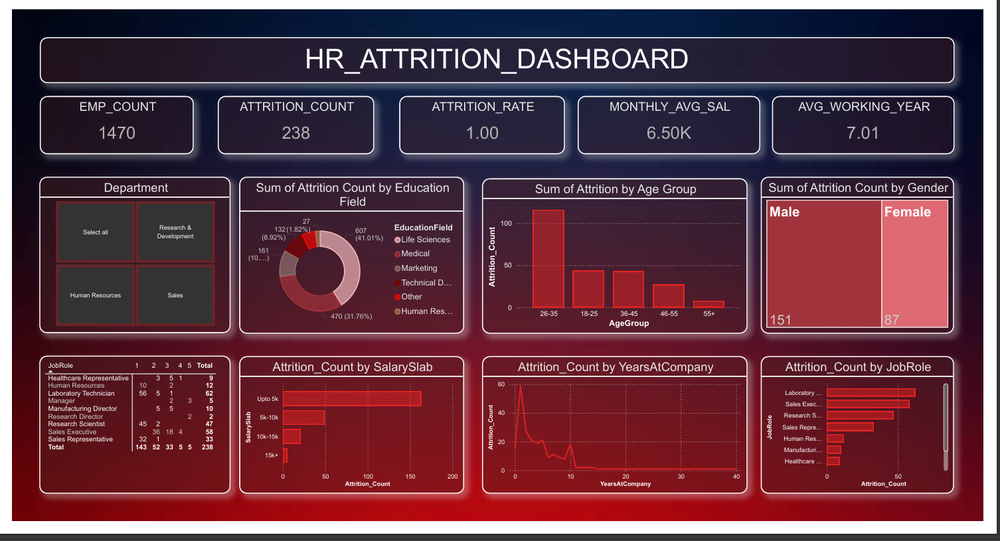

# 📊 HR Attrition Dashboard (Power BI)

## 📌 Overview
This project analyzes employee attrition data using Power BI to identify key factors affecting employee turnover. The dashboard provides actionable insights for HR decision-making.

---

## 🎯 Objectives
- Analyze employee attrition patterns
- Identify key factors influencing attrition
- Provide visual insights for HR strategies
- Improve employee retention decisions

---

## 📂 Dataset
- Source: HR Analytics Dataset
- File: `HR_Analytic.csv`
- Records: 1470 employees

---

## 📊 Dashboard Features

- ✅ Total Employees Count
- ✅ Attrition Count & Rate
- ✅ Average Salary & Experience
- ✅ Attrition by Gender
- ✅ Attrition by Education Field
- ✅ Attrition by Age Group
- ✅ Attrition by Job Role
- ✅ Attrition by Salary Slab
- ✅ Attrition by Years at Company

---

## 📈 Key Insights

- Total Employees: 1470  
- Attrition Count: 238  
- Highest attrition observed in:
  - Age group: 26–35
  - Job Role: Laboratory Technician & Sales Executive
  - Salary slab: Up to 5K

*(Based on dashboard analysis)*

---

## 🛠️ Tools & Technologies
- Power BI
- Data Visualization
- Data Analysis

---

## 📷 Dashboard Preview

  

## 🔮 Future Improvements
- Add predictive attrition model (ML)
- Integrate real-time HR data
- Deploy dashboard on Power BI Service

---

## 👩‍💻 Author
Vishakha Patel
